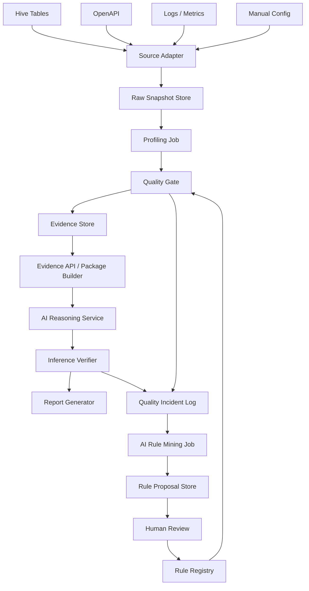
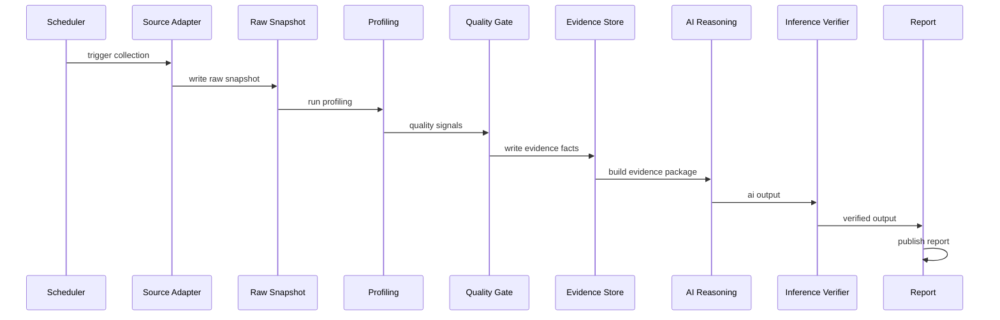
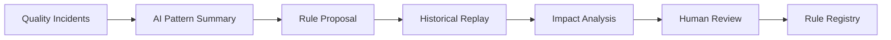

# AI 数据质量与推断质量保障系统工程设计

> 版本：v0.1  
> 日期：2026-05-16  
> 评审对象：架构师、后端开发、数据平台开发、后续 AI 详细设计/开发 Agent  
> 状态：Draft

## 0. 摘要

本文设计一套轻量、可演进的数据质量与 AI 推断质量保障系统。系统面向多源数据输入场景，例如 Hive 表、OpenAPI、日志、监控指标、人工配置等。核心目标不是让 AI “自动相信数据并做判断”，而是让 AI 只消费经过质量闸门处理后的标准证据包，并通过推断校验器约束 AI 输出。

系统采用以下原则：

- 原始数据必须先落 Raw Snapshot，便于追溯和回放。
- AI 不直接读取原始 Hive 表、OpenAPI 响应或日志。
- 数据事实先被标准化为 Evidence Fact，再组装为 Evidence Package。
- 质量判断由确定性规则引擎完成，AI 只解释和总结规则结果。
- AI 可以辅助发现 edge case、生成候选规则和测试样例，但不能自动修改生产规则。
- 在只有一个人维护的约束下，优先使用 MySQL + Redis 的轻量组合；MongoDB 作为可选扩展。

诚实标记：本文是基于前期讨论、Dify / OpenViking / browser-use / OpenManus 的实现级模式观察，以及常见数据质量工程实践的架构推演。它不是某个开源项目的直接复刻。

## 1. 背景与问题

AI 系统在做数据分析、诊断、建议、报告生成时，常见风险包括：

1. 输入数据不新鲜、不完整、重复、字段变更或多源冲突。
2. OpenAPI 超时、限流、返回空结果、返回 schema 漂移。
3. AI 把 degraded 数据当成确定事实。
4. AI 引用证据包之外的事实。
5. AI 在关键证据 blocked 的情况下仍输出业务建议。
6. 单人维护时，如果靠手写 if/else 覆盖所有 edge case，维护成本会快速失控。

因此系统需要同时解决两类质量：

- 数据质量：输入事实是否可信。
- 推断质量：AI 是否基于证据、是否越界、是否正确表达不确定性。

## 2. 目标与非目标

### 2.1 目标

- 建立多源数据采集与原始快照机制。
- 建立通用数据画像与质量检查能力。
- 形成标准化数据事实库 Evidence Store。
- 为 AI 提供结构化 Evidence Package。
- 通过 Quality Gate 阻断低质量数据进入 AI 推断链路。
- 通过 Inference Verifier 校验 AI 输出质量。
- 建立质量事件库，支撑 AI 辅助规则挖掘。
- 支持单人 MVP 落地，并能平滑演进到服务化架构。

### 2.2 非目标

- 第一版不做自动修复源数据。
- 第一版不做自动修改生产质量规则。
- 第一版不做复杂多 Agent 协作。
- 第一版不做自动执行业务动作。
- 第一版不强依赖图数据库、向量数据库或大规模实时流处理。

## 3. 总体架构



系统分为三条主链路：

1. 数据进入链路：Source Adapter -> Raw Snapshot -> Profiling -> Quality Gate -> Evidence Store。
2. AI 推断链路：Evidence Package -> AI Reasoning -> Inference Verifier -> Report。
3. 规则维护链路：Quality Incident Log -> AI Rule Mining -> Rule Proposal -> Human Review -> Rule Registry。

## 4. 关键架构原则

### 4.1 AI 不直接接触原始数据

原始 Hive 查询结果、OpenAPI 响应、日志明细等必须先进入 Raw Snapshot，再经过标准化和质量检查后形成 Evidence Package。AI 只读取 Evidence Package。

### 4.2 blocker 规则优先于综合分

综合质量分只用于排序和粗略判断。如果关键字段缺失、多源冲突、核心 API 无可用缓存，即使综合分较高，也必须 blocked。

### 4.3 推断输出必须可验证

AI 输出必须带 evidence_refs。数字、事实、结论必须能在 Evidence Package 中找到来源。

### 4.4 AI 辅助维护，不自动生效

AI 可以生成候选规则，但规则上线必须经过人工确认和历史回放。

## 5. 服务与模块设计

### 5.1 Source Adapter

#### 职责

- 统一接入 Hive、OpenAPI、日志、监控、人工配置。
- 标准化采集错误。
- 保存请求与响应摘要。
- 写入 Raw Snapshot。

#### OpenAPI 采集要求

- timeout_ms 可配置。
- retry_count 可配置。
- 支持指数退避。
- 支持 Redis 缓存。
- 支持 fallback 到最近一次成功结果。
- 所有失败必须记录 error_type。

#### 标准错误类型

```text
timeout
http_4xx
http_5xx
auth_error
rate_limited
schema_error
empty_response
partial_response
unknown_error
```

#### 输出

Raw Snapshot 记录。

### 5.2 Raw Snapshot Store

#### 职责

- 保存原始响应或原始响应位置。
- 支持审计、回放、Debug、规则重算。

#### MVP 存储选择

- 小规模：MySQL `raw_snapshot` 表保存响应摘要，完整 raw_json 可直接存在 JSON 字段。
- 中大规模：MySQL 只存索引，完整响应放对象存储或 MongoDB。

### 5.3 Profiling Job

#### 职责

对数据源生成自动画像。

Hive 画像：

- 最新分区时间。
- 行数。
- null rate。
- distinct count。
- 主键重复率。
- 数值范围。
- schema diff。
- 行数波动。

OpenAPI 画像：

- 成功率。
- 延迟。
- 重试次数。
- cache age。
- 字段缺失率。
- schema diff。
- 错误类型分布。

### 5.4 Quality Gate

#### 职责

- 读取 Profiling Result、Raw Snapshot metadata、Rule Registry。
- 输出质量状态：ok / degraded / blocked。
- 生成 Quality Check Result。
- 记录质量事件。

#### 状态定义

| 状态 | 含义 | AI 行为 |
|---|---|---|
| ok | 数据可信 | 允许正常推断 |
| degraded | 数据有瑕疵 | 允许总结，但必须标注不确定性 |
| blocked | 关键证据不可信 | 禁止业务结论，只能输出质量问题 |

### 5.5 Evidence Store

#### 职责

- 保存标准化事实。
- 为 Evidence Package Builder 提供查询基础。
- 支持按 entity、fact_name、source、dt、quality_status 查询。

#### 数据模型

采用关系模型 + EAV + JSON 扩展。

核心形式：

```text
entity_id + fact_name + value + source + quality + time
```

### 5.6 Evidence Package Builder / Evidence API

#### 职责

- 从 Evidence Store 读取 facts。
- 汇总质量状态。
- 生成 AI 可消费的 Evidence Package。
- 生成 allowed_conclusions 与 forbidden_conclusions。

#### 输出示例

```json
{
  "package_id": "pkg_20260516_001",
  "entity_id": "entity_xxx",
  "entity_type": "resource",
  "quality_summary": {
    "overall_status": "degraded",
    "warnings": ["topology API timeout, used 6h cache"]
  },
  "facts": [
    {
      "fact_id": "fact_001",
      "name": "cpu_p95_30d",
      "value": 18.4,
      "source": "hive.monitoring_daily",
      "as_of": "2026-05-16T00:00:00Z",
      "quality_status": "ok"
    }
  ],
  "allowed_conclusions": ["can_summarize", "can_suggest_manual_review"],
  "forbidden_conclusions": ["cannot_claim_safe_to_execute"]
}
```

### 5.7 AI Reasoning Service

#### 职责

- 基于 Evidence Package 生成报告、解释、建议。
- 不重新计算事实。
- 不直接访问原始数据源。

#### 输出协议

```json
{
  "conclusion": "",
  "evidence_refs": [],
  "uncertainties": [],
  "cannot_determine": [],
  "next_steps": []
}
```

### 5.8 Inference Verifier

#### 职责

校验 AI 输出。

检查项：

- 输出事实是否都能在 Evidence Package 中找到引用。
- 数字是否和 evidence facts 一致。
- 是否越过 forbidden_conclusions。
- degraded 状态下是否说明不确定性。
- blocked 状态下是否仍输出业务建议。
- 是否出现无来源的绝对化表达。

#### 输出

```json
{
  "verification_status": "failed",
  "risk_level": "high",
  "issues": [
    "AI referenced fact not present in evidence package",
    "AI made business recommendation under blocked quality status"
  ]
}
```

### 5.9 Report Generator

#### 职责

- 生成 Markdown / 飞书文档 / 邮件 / Dashboard 摘要。
- 把 AI 输出、Verifier 结果、Evidence 摘要合并为最终报告。

### 5.10 Quality Incident Log

#### 职责

- 记录数据质量问题。
- 记录 AI 推断质量问题。
- 支撑 AI 规则挖掘与人工复盘。

### 5.11 AI Rule Mining Job

#### 职责

- 聚类高频质量事件。
- 总结 recurring edge cases。
- 生成候选规则。
- 生成测试样例。
- 生成历史影响分析。

AI Rule Mining Job 不直接修改 Rule Registry。

## 6. 存储选型

### 6.1 可选存储

当前可选：MySQL、MongoDB、Redis。

推荐：

| 存储 | 定位 |
|---|---|
| MySQL | 主事实库、规则库、质量结果、事件、审核状态 |
| Redis | OpenAPI 缓存、任务锁、限流、短期状态 |
| MongoDB | 可选，存大 JSON 原始响应或复杂证据包正文 |

MVP 推荐使用 MySQL + Redis。MongoDB 暂缓，除非 raw response 或 evidence package 体积明显过大。

### 6.2 MySQL 负责的数据

- source_registry
- rule_registry
- raw_snapshot index
- data_profile_result
- quality_check_result
- evidence_fact
- evidence_package
- inference_log
- quality_incident_log
- rule_proposal
- entity_relation

### 6.3 Redis 负责的数据

- OpenAPI response cache。
- job lock。
- retry state。
- rate limit counter。
- 最近成功结果缓存。

### 6.4 MongoDB 何时引入

满足以下条件时再引入：

- 原始 API 响应非常大。
- evidence package 嵌套结构复杂且 schema 高频变化。
- AI debug payload 需要长期保留全文。

引入 MongoDB 后，MySQL 只保存索引和状态，MongoDB 保存正文。

## 7. MySQL 数据建模

### 7.1 source_registry

```sql
CREATE TABLE source_registry (
    source_name VARCHAR(255) PRIMARY KEY,
    source_type VARCHAR(64) NOT NULL,
    owner VARCHAR(255),
    freshness_sla_minutes INT,
    timeout_ms INT,
    retry_count INT,
    cache_ttl_minutes INT,
    is_critical BOOLEAN NOT NULL DEFAULT FALSE,
    config_json JSON,
    created_at DATETIME DEFAULT CURRENT_TIMESTAMP,
    updated_at DATETIME DEFAULT CURRENT_TIMESTAMP ON UPDATE CURRENT_TIMESTAMP
);
```

### 7.2 raw_snapshot

```sql
CREATE TABLE raw_snapshot (
    id BIGINT AUTO_INCREMENT PRIMARY KEY,
    batch_id VARCHAR(255) NOT NULL,
    source_name VARCHAR(255) NOT NULL,
    source_type VARCHAR(64) NOT NULL,
    entity_id VARCHAR(255),
    request_json JSON,
    response_json JSON,
    response_location VARCHAR(1024),
    status VARCHAR(32) NOT NULL,
    error_type VARCHAR(64),
    error_message TEXT,
    fetched_at DATETIME NOT NULL,
    dt DATE NOT NULL,
    INDEX idx_raw_batch (batch_id),
    INDEX idx_raw_source_dt (source_name, dt),
    INDEX idx_raw_entity_dt (entity_id, dt)
);
```

### 7.3 data_profile_result

```sql
CREATE TABLE data_profile_result (
    id BIGINT AUTO_INCREMENT PRIMARY KEY,
    batch_id VARCHAR(255) NOT NULL,
    source_name VARCHAR(255) NOT NULL,
    entity_id VARCHAR(255),
    profile_type VARCHAR(64) NOT NULL,
    metric_name VARCHAR(255) NOT NULL,
    metric_value DOUBLE,
    metric_value_json JSON,
    baseline_value DOUBLE,
    deviation_ratio DOUBLE,
    status VARCHAR(32) NOT NULL,
    created_at DATETIME DEFAULT CURRENT_TIMESTAMP,
    dt DATE NOT NULL,
    INDEX idx_profile_source_dt (source_name, dt),
    INDEX idx_profile_entity_dt (entity_id, dt),
    INDEX idx_profile_metric_dt (metric_name, dt)
);
```

### 7.4 rule_registry

```sql
CREATE TABLE rule_registry (
    rule_id VARCHAR(255) PRIMARY KEY,
    rule_yaml TEXT NOT NULL,
    status VARCHAR(32) NOT NULL,
    version INT NOT NULL,
    severity VARCHAR(32) NOT NULL,
    created_by VARCHAR(255),
    created_at DATETIME DEFAULT CURRENT_TIMESTAMP,
    updated_at DATETIME DEFAULT CURRENT_TIMESTAMP ON UPDATE CURRENT_TIMESTAMP,
    INDEX idx_rule_status (status)
);
```

### 7.5 quality_check_result

```sql
CREATE TABLE quality_check_result (
    id BIGINT AUTO_INCREMENT PRIMARY KEY,
    batch_id VARCHAR(255) NOT NULL,
    source_name VARCHAR(255) NOT NULL,
    entity_id VARCHAR(255),
    rule_id VARCHAR(255) NOT NULL,
    severity VARCHAR(32) NOT NULL,
    result VARCHAR(32) NOT NULL,
    reason TEXT,
    detail_json JSON,
    created_at DATETIME DEFAULT CURRENT_TIMESTAMP,
    dt DATE NOT NULL,
    INDEX idx_qcr_entity_dt (entity_id, dt),
    INDEX idx_qcr_source_dt (source_name, dt),
    INDEX idx_qcr_rule_dt (rule_id, dt),
    INDEX idx_qcr_result_dt (result, dt)
);
```

### 7.6 evidence_fact

```sql
CREATE TABLE evidence_fact (
    id BIGINT AUTO_INCREMENT PRIMARY KEY,
    entity_id VARCHAR(255) NOT NULL,
    entity_type VARCHAR(100) NOT NULL,
    fact_name VARCHAR(255) NOT NULL,
    fact_value_string TEXT,
    fact_value_number DOUBLE,
    fact_value_bool BOOLEAN,
    fact_value_json JSON,
    source_name VARCHAR(255) NOT NULL,
    source_type VARCHAR(64) NOT NULL,
    as_of DATETIME NOT NULL,
    dt DATE NOT NULL,
    quality_status VARCHAR(32) NOT NULL,
    quality_score DOUBLE,
    confidence DOUBLE,
    raw_snapshot_id VARCHAR(255),
    lineage_json JSON,
    created_at DATETIME DEFAULT CURRENT_TIMESTAMP,
    INDEX idx_ev_entity_fact_dt (entity_id, fact_name, dt),
    INDEX idx_ev_fact_dt (fact_name, dt),
    INDEX idx_ev_quality_dt (quality_status, dt),
    INDEX idx_ev_source_dt (source_name, dt)
);
```

### 7.7 evidence_package

```sql
CREATE TABLE evidence_package (
    package_id VARCHAR(255) PRIMARY KEY,
    entity_id VARCHAR(255) NOT NULL,
    entity_type VARCHAR(100) NOT NULL,
    package_json JSON NOT NULL,
    overall_quality_status VARCHAR(32) NOT NULL,
    allowed_conclusions JSON,
    forbidden_conclusions JSON,
    created_at DATETIME DEFAULT CURRENT_TIMESTAMP,
    dt DATE NOT NULL,
    INDEX idx_pkg_entity_dt (entity_id, dt),
    INDEX idx_pkg_quality_dt (overall_quality_status, dt)
);
```

### 7.8 inference_log

```sql
CREATE TABLE inference_log (
    id BIGINT AUTO_INCREMENT PRIMARY KEY,
    entity_id VARCHAR(255) NOT NULL,
    evidence_package_id VARCHAR(255) NOT NULL,
    task_type VARCHAR(100) NOT NULL,
    prompt_version VARCHAR(64),
    model_name VARCHAR(255),
    ai_output_json JSON,
    verifier_status VARCHAR(32),
    verifier_issues_json JSON,
    created_at DATETIME DEFAULT CURRENT_TIMESTAMP,
    dt DATE NOT NULL,
    INDEX idx_infer_entity_dt (entity_id, dt),
    INDEX idx_infer_pkg (evidence_package_id),
    INDEX idx_infer_status_dt (verifier_status, dt)
);
```

### 7.9 quality_incident_log

```sql
CREATE TABLE quality_incident_log (
    id BIGINT AUTO_INCREMENT PRIMARY KEY,
    entity_id VARCHAR(255),
    source_name VARCHAR(255),
    source_type VARCHAR(64),
    incident_type VARCHAR(100) NOT NULL,
    error_type VARCHAR(100),
    raw_error TEXT,
    quality_status VARCHAR(32),
    policy_decision VARCHAR(32),
    ai_summary TEXT,
    human_label VARCHAR(64),
    final_resolution TEXT,
    created_at DATETIME DEFAULT CURRENT_TIMESTAMP,
    dt DATE NOT NULL,
    INDEX idx_incident_entity_dt (entity_id, dt),
    INDEX idx_incident_source_dt (source_name, dt),
    INDEX idx_incident_type_dt (incident_type, dt),
    INDEX idx_incident_label_dt (human_label, dt)
);
```

### 7.10 rule_proposal

```sql
CREATE TABLE rule_proposal (
    proposal_id VARCHAR(255) PRIMARY KEY,
    suggested_rule_yaml TEXT NOT NULL,
    reason TEXT,
    historical_impact_json JSON,
    status VARCHAR(32) NOT NULL,
    created_at DATETIME DEFAULT CURRENT_TIMESTAMP,
    updated_at DATETIME DEFAULT CURRENT_TIMESTAMP ON UPDATE CURRENT_TIMESTAMP,
    INDEX idx_rule_proposal_status (status)
);
```

### 7.11 entity_relation

```sql
CREATE TABLE entity_relation (
    id BIGINT AUTO_INCREMENT PRIMARY KEY,
    from_entity_id VARCHAR(255) NOT NULL,
    from_entity_type VARCHAR(100) NOT NULL,
    to_entity_id VARCHAR(255) NOT NULL,
    to_entity_type VARCHAR(100) NOT NULL,
    relation_type VARCHAR(100) NOT NULL,
    confidence DOUBLE,
    source_name VARCHAR(255),
    created_at DATETIME DEFAULT CURRENT_TIMESTAMP,
    INDEX idx_relation_from (from_entity_id, relation_type),
    INDEX idx_relation_to (to_entity_id, relation_type)
);
```

## 8. 规则模型

### 8.1 规则格式

第一版使用 YAML。

```yaml
id: api_cache_too_old
description: API fallback cache is too old
source_type: openapi
severity: blocker
condition:
  field: cache_age_minutes
  op: ">"
  value: 1440
effect:
  quality_status: blocked
  reason: API cache older than 24h
```

### 8.2 条件操作符

支持：

```text
=
!=
>
>=
<
<=
in
not_in
exists
not_exists
contains
regex
```

### 8.3 组合规则

```yaml
id: api_timeout_with_no_cache
severity: blocker
condition:
  all:
    - field: error_type
      op: "="
      value: timeout
    - field: cache_hit
      op: "="
      value: false
```

## 9. 质量评分模型

### 9.1 Hive 分数

```text
score =
  freshness * 0.25
+ schema * 0.15
+ completeness * 0.20
+ volume * 0.15
+ uniqueness * 0.10
+ range * 0.10
+ consistency * 0.05
```

### 9.2 OpenAPI 分数

```text
score =
  availability * 0.30
+ latency * 0.15
+ retry * 0.10
+ schema * 0.15
+ completeness * 0.15
+ cache_age * 0.10
+ consistency * 0.05
```

### 9.3 状态映射

```text
score >= 0.9       ok
0.7 <= score < 0.9 degraded
score < 0.7        blocked
```

blocker 规则优先于分数映射。

## 10. Evidence Package 设计

### 10.1 Package 结构

```json
{
  "package_id": "pkg_001",
  "entity_id": "entity_xxx",
  "entity_type": "resource",
  "quality_summary": {
    "overall_status": "degraded",
    "score": 0.82,
    "blockers": [],
    "warnings": ["api retry succeeded"]
  },
  "facts": [
    {
      "fact_id": "fact_001",
      "name": "topology_dependency_count",
      "value": 12,
      "source": "openapi.topology",
      "as_of": "2026-05-16T10:00:00Z",
      "quality_status": "degraded",
      "confidence": 0.75
    }
  ],
  "allowed_conclusions": [
    "can_summarize",
    "can_suggest_manual_review"
  ],
  "forbidden_conclusions": [
    "cannot_claim_safe_to_execute",
    "cannot_generate_final_business_action"
  ]
}
```

### 10.2 Package 构建规则

- blocked facts 可以进入 package，但必须标注，且限制 allowed_conclusions。
- 如果关键 fact blocked，package overall_status 必须 blocked。
- degraded package 必须要求 AI 输出 uncertainties。
- 每个 fact 必须带 source、as_of、quality_status、confidence。

## 11. AI 推断与校验

### 11.1 Prompt 输入边界

AI 输入只包含：

- task_type
- Evidence Package
- output_schema
- policy constraints

AI 不拿：

- raw_snapshot response_json
- 未校验 Hive 明细
- 未校验 OpenAPI 原始响应

### 11.2 AI 输出 schema

```json
{
  "conclusion": "",
  "evidence_refs": ["fact_001"],
  "uncertainties": [],
  "cannot_determine": [],
  "next_steps": [],
  "risk_level": "low"
}
```

### 11.3 Verifier 校验

Verifier 做确定性检查：

- evidence_refs 中的 fact_id 是否存在。
- 输出数字是否与 evidence facts 一致。
- 是否使用 Evidence Package 外事实。
- 是否违反 forbidden_conclusions。
- degraded 是否缺少 uncertainties。
- blocked 是否仍输出业务动作。

校验失败时：

- 不发布最终报告。
- 写入 inference_log。
- 写入 quality_incident_log。
- 可触发 AI 重新生成，附带 verifier issues。

## 12. AI 辅助规则维护

### 12.1 事件沉淀

所有质量异常和推断异常写入 `quality_incident_log`。

### 12.2 人工标签

支持标签：

```text
true_blocker
false_blocker
should_degrade
source_bug
expected_behavior
unknown
```

### 12.3 AI Rule Mining

每周运行：

1. 聚合高频 incident_type。
2. 找出重复 pattern。
3. 生成候选规则。
4. 生成测试样例。
5. 用历史数据回放，产出影响分析。

候选规则进入 `rule_proposal`，状态为 pending。

### 12.4 人工确认

人工确认后：

- accepted -> 写入 rule_registry，状态 active。
- rejected -> 保留原因，不生效。

## 13. 数据流

### 13.1 日常批处理



### 13.2 规则维护



## 14. API 设计草案

### 14.1 Evidence API

```http
GET /api/v1/evidence/packages/{package_id}
GET /api/v1/evidence/packages/latest?entity_id=xxx
GET /api/v1/evidence/facts?entity_id=xxx&dt=2026-05-16
```

### 14.2 Quality API

```http
GET /api/v1/quality/check-results?entity_id=xxx&dt=2026-05-16
POST /api/v1/quality/replay-rules
```

### 14.3 Rule API

```http
GET /api/v1/rules
POST /api/v1/rule-proposals/{proposal_id}/accept
POST /api/v1/rule-proposals/{proposal_id}/reject
```

### 14.4 Report API

```http
POST /api/v1/reports/generate
GET /api/v1/reports/{report_id}
```

## 15. 部署设计

### 15.1 MVP

```text
cron / Airflow
  -> Python batch jobs
  -> MySQL
  -> Redis
  -> AI report generator
```

### 15.2 服务化

```text
API Gateway
  -> Source Adapter Service
  -> Quality Service
  -> Evidence Service
  -> AI Reasoning Service
  -> Verifier Service
  -> Report Service
  -> Rule Mining Service
```

## 16. 工程目录建议

```text
data-quality-ai/
├── configs/
│   ├── sources.yaml
│   ├── rules.yaml
│   └── prompts.yaml
├── jobs/
│   ├── collect_sources.py
│   ├── run_profiling.py
│   ├── run_quality_gate.py
│   ├── build_evidence.py
│   ├── run_inference.py
│   └── generate_report.py
├── services/
│   ├── source_adapter/
│   ├── quality_gate/
│   ├── evidence/
│   ├── ai_reasoning/
│   ├── verifier/
│   └── rule_mining/
├── models/
│   ├── source.py
│   ├── evidence.py
│   ├── quality.py
│   └── inference.py
├── rules/
│   └── active_rules.yaml
├── reports/
└── tests/
```

## 17. 测试策略

### 17.1 单元测试

- 规则解析。
- 条件表达式求值。
- 质量分计算。
- Evidence Package 构建。
- Verifier 校验。

### 17.2 回放测试

使用历史 raw_snapshot 回放：

- 新规则改变了多少 quality_status。
- blocked 数量是否异常增加。
- 是否误伤人工标注为 expected_behavior 的样本。

### 17.3 AI 输出测试

固定样例：

- ok package。
- degraded package。
- blocked package。
- evidence conflict。
- AI 数字不一致。
- AI 引用不存在事实。

预期：

- Verifier 能捕获越界推断。

## 18. 可观测性

### 18.1 指标

- source collection success rate。
- API timeout rate。
- cache hit rate。
- quality status 分布。
- blocked entity 数。
- degraded entity 数。
- verifier failed rate。
- rule proposal accepted rate。

### 18.2 日志

- 每次采集 batch_id。
- 每条规则命中情况。
- 每次 AI 输出与 verifier 结果。
- 每次规则变更。

### 18.3 告警

- critical source 连续失败。
- blocked 数量突增。
- verifier failed rate 突增。
- rule mining job 失败。

## 19. 安全与权限

- AI 只读 Evidence Package。
- Rule Registry 修改需要人工权限。
- Source credentials 不进入 AI prompt。
- Raw Snapshot 中敏感字段需要脱敏或访问控制。
- inference_log 需要保留模型、prompt_version 和 package_id，便于审计。

## 20. MVP 里程碑

### Phase 1：批处理 MVP

- Source Adapter 支持 Hive / OpenAPI。
- Raw Snapshot 入库。
- 基础质量检查。
- Evidence Fact 入库。
- Evidence Package 生成。
- AI 报告生成。

### Phase 2：推断校验

- AI 输出 schema 固定。
- Inference Verifier 上线。
- inference_log 入库。

### Phase 3：质量事件闭环

- quality_incident_log 上线。
- 每周 AI 维护报告。
- rule_proposal 生成。

### Phase 4：规则回放与审核

- 支持历史回放。
- 支持人工 accept / reject。
- Rule Registry 版本化。

### Phase 5：服务化

- Evidence API。
- Quality API。
- Rule API。
- Report API。

## 21. 后续 AI 详细设计任务拆分建议

后续 AI 可以按以下顺序展开详细设计：

1. MySQL schema migration 详细设计。
2. Rule DSL 与规则执行器详细设计。
3. Source Adapter 框架详细设计。
4. Profiling Job 详细设计。
5. Evidence Package Builder 详细设计。
6. AI 输出 schema 与 prompt 详细设计。
7. Inference Verifier 详细设计。
8. Rule Mining Job 详细设计。
9. Report Generator 详细设计。
10. 回放测试框架详细设计。

## 22. 最终原则

本系统的核心不是让 AI 自动保证数据质量，而是：

> 用确定性系统建立事实边界，用 AI 辅助解释、总结和维护；让坏数据可发现、可阻断、可回放、可修正。

最小闭环：

```text
Raw Snapshot
-> Quality Gate
-> Evidence Store
-> Evidence Package
-> AI Reasoning
-> Inference Verifier
-> Quality Incident Log
-> AI Rule Mining
-> Human Review
-> Rule Registry
```
