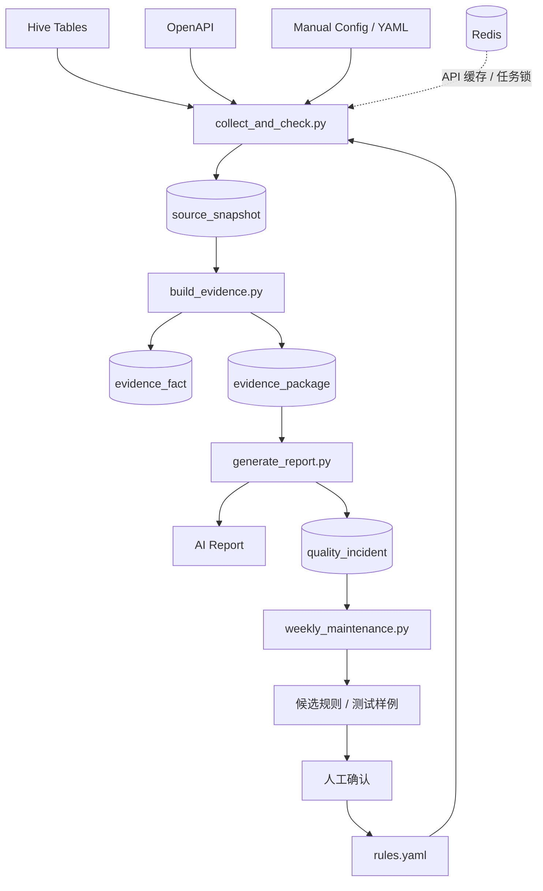

# AI 数据质量与推断质量保障系统：单人最小闭环工程设计

> 版本：v0.1
> 日期：2026-05-16
> 评审对象：架构师、后端开发、数据平台开发、后续 AI 详细设计/开发 Agent
> 定位：单人可维护 MVP，不是完整平台蓝图
> 状态：Draft

## 0. 摘要

本文重新收敛 AI 数据质量与推断质量保障系统的工程设计，目标是在只有一个人设计、开发、维护的情况下，建立一个最小但可靠的闭环。

与完整平台蓝图不同，本 MVP 不拆多个微服务，不引入十几张表，不强依赖 MongoDB、图数据库或向量数据库。第一版只使用：

- MySQL：核心事实、证据包、质量事件、规则配置。
- Redis：OpenAPI 缓存、任务锁、限流和临时状态。
- Python 脚本 / 定时任务：采集、检查、构建证据、生成报告。
- YAML：数据源配置和质量规则。

最小闭环：

```text
Hive / OpenAPI
-> collect_and_check.py
-> source_snapshot
-> build_evidence.py
-> evidence_fact
-> evidence_package
-> generate_report.py
-> AI 报告 + quality_incident
-> weekly_maintenance.py
-> 候选规则
-> 人工确认
```

诚实标记：本文是基于前期完整工程蓝图、实现级参考项目观察，以及单人维护约束下的工程取舍整理而成。它故意牺牲平台化完整性，换取低维护成本和快速落地。

## 1. 设计目标

### 1.1 目标

- 用最少组件保障 AI 输入数据质量。
- 用标准证据包约束 AI 推断边界。
- 坏数据不静默进入 AI 结论。
- AI 输出能被规则校验。
- 质量事件能沉淀，后续由 AI 辅助总结候选规则。
- 一个人可以长期维护。

### 1.2 非目标

- 不做微服务拆分。
- 不做独立 Evidence API。
- 不做复杂审批平台。
- 不做自动修复数据。
- 不做自动上线规则。
- 不做自动执行业务动作。
- 不做复杂血缘平台。
- 不做多 Agent 协作。

## 2. 核心设计原则

### 2.1 AI 不直接读原始源

AI 不直接读取：

- Hive 原始查询结果。
- OpenAPI 原始响应。
- 日志明细。
- 未校验的 JSON payload。

AI 只读取 `evidence_package`。

### 2.2 单人维护优先

如果一个设计需要长期维护多个服务、多个存储和复杂调度，则第一版不采用。

第一版接受：

- 一个 MySQL。
- 一个 Redis。
- 3 到 4 个 Python 脚本。
- 4 张核心表。
- 一个 YAML 规则文件。

### 2.3 默认保守

质量判断默认保守：

```text
关键证据缺失 -> blocked
多源关键事实冲突 -> blocked
非关键证据异常 -> degraded
未知错误 -> needs_review 或 blocked
```

### 2.4 AI 辅助维护，不自动维护

AI 可以：

- 总结高频异常。
- 归类 edge case。
- 生成候选规则。
- 生成测试样例。
- 生成维护报告。

AI 不可以：

- 自动修改生产规则。
- 自动放宽 blocker。
- 自动忽略质量异常。
- 自动执行业务动作。

## 3. MVP 总体架构



### 3.1 数据主链路

```text
Hive / OpenAPI
-> source_snapshot
-> evidence_fact
-> evidence_package
-> AI report
```

### 3.2 维护闭环

```text
quality_incident
-> weekly_maintenance.py
-> AI 生成候选规则
-> 人工确认
-> rules.yaml
```

## 4. 文件与脚本设计

### 4.1 推荐目录

```text
ai-data-quality-mvp/
├── configs/
│   ├── sources.yaml
│   ├── rules.yaml
│   └── prompts.yaml
├── jobs/
│   ├── collect_and_check.py
│   ├── build_evidence.py
│   ├── generate_report.py
│   └── weekly_maintenance.py
├── lib/
│   ├── source_clients.py
│   ├── quality_rules.py
│   ├── evidence_builder.py
│   ├── inference_verifier.py
│   └── ai_client.py
├── migrations/
│   └── 001_init.sql
├── reports/
└── tests/
```

### 4.2 collect_and_check.py

#### 职责

合并完整蓝图里的：

- Source Adapter
- Raw Snapshot
- Profiling
- Quality Gate

#### 输入

- `configs/sources.yaml`
- `configs/rules.yaml`
- Hive 表
- OpenAPI
- Redis 缓存

#### 输出

- 写入 `source_snapshot`

#### 核心步骤

```text
1. 读取 sources.yaml
2. 采集 Hive / OpenAPI
3. 对 OpenAPI 做 timeout / retry / cache fallback
4. 生成基础 profile_json
5. 执行 rules.yaml
6. 生成 quality_json
7. 写入 source_snapshot
```

### 4.3 build_evidence.py

#### 职责

从 `source_snapshot` 构建标准事实和 AI 证据包。

#### 输入

- `source_snapshot`

#### 输出

- `evidence_fact`
- `evidence_package`

#### 核心步骤

```text
1. 按 batch_id / dt 读取 source_snapshot
2. 抽取标准事实
3. 写入 evidence_fact
4. 按 entity_id 聚合 facts
5. 根据 quality_json 生成 allowed_conclusions / forbidden_conclusions
6. 写入 evidence_package
```

### 4.4 generate_report.py

#### 职责

生成 AI 报告，并校验 AI 输出。

#### 输入

- `evidence_package`
- `configs/prompts.yaml`

#### 输出

- Markdown / 飞书文档内容
- `quality_incident`

#### 核心步骤

```text
1. 读取当天 evidence_package
2. 调用 AI 生成结构化输出
3. 运行 inference_verifier
4. 校验通过则生成报告
5. 校验失败则写入 quality_incident
```

### 4.5 weekly_maintenance.py

#### 职责

每周用 AI 辅助维护质量规则。

#### 输入

- 最近 7 天 `quality_incident`
- 当前 `rules.yaml`

#### 输出

- 周维护报告
- 候选规则 YAML
- 测试样例草案

#### 注意

候选规则不自动写入 `rules.yaml`。必须人工确认。

## 5. MySQL 表设计

MVP 只保留 4 张核心表。

### 5.1 source_snapshot

合并完整架构中的：

- raw_snapshot
- data_profile_result
- quality_check_result

#### 用途

保存每次数据源采集、画像、质量检查的结果。

#### Schema

```sql
CREATE TABLE source_snapshot (
    id BIGINT AUTO_INCREMENT PRIMARY KEY,
    batch_id VARCHAR(255) NOT NULL,
    source_name VARCHAR(255) NOT NULL,
    source_type VARCHAR(64) NOT NULL,
    entity_id VARCHAR(255),

    status VARCHAR(32) NOT NULL,
    error_type VARCHAR(64),
    error_message TEXT,

    raw_json JSON,
    profile_json JSON,
    quality_json JSON,

    fetched_at DATETIME NOT NULL,
    dt DATE NOT NULL,
    created_at DATETIME DEFAULT CURRENT_TIMESTAMP,

    INDEX idx_ss_batch (batch_id),
    INDEX idx_ss_source_dt (source_name, dt),
    INDEX idx_ss_entity_dt (entity_id, dt),
    INDEX idx_ss_status_dt (status, dt)
);
```

#### 字段说明

| 字段 | 说明 |
|---|---|
| raw_json | 原始响应或摘要 |
| profile_json | 自动画像结果，例如 row_count、null_rate、latency_ms |
| quality_json | 规则命中、质量状态、blockers、warnings |

### 5.2 evidence_fact

#### 用途

保存标准化事实明细。

#### Schema

```sql
CREATE TABLE evidence_fact (
    id BIGINT AUTO_INCREMENT PRIMARY KEY,
    batch_id VARCHAR(255) NOT NULL,
    entity_id VARCHAR(255) NOT NULL,
    entity_type VARCHAR(100) NOT NULL,
    fact_name VARCHAR(255) NOT NULL,

    fact_value_string TEXT,
    fact_value_number DOUBLE,
    fact_value_bool BOOLEAN,
    fact_value_json JSON,

    source_name VARCHAR(255) NOT NULL,
    source_snapshot_id BIGINT,

    as_of DATETIME NOT NULL,
    dt DATE NOT NULL,

    quality_status VARCHAR(32) NOT NULL,
    confidence DOUBLE,

    created_at DATETIME DEFAULT CURRENT_TIMESTAMP,

    INDEX idx_ef_batch (batch_id),
    INDEX idx_ef_entity_fact_dt (entity_id, fact_name, dt),
    INDEX idx_ef_fact_dt (fact_name, dt),
    INDEX idx_ef_quality_dt (quality_status, dt)
);
```

#### 示例

```text
entity_id = redis-prod-session
entity_type = redis_cluster
fact_name = memory_p95_30d
fact_value_number = 48.2
source_name = hive.monitoring_daily
quality_status = ok
confidence = 0.93
```

### 5.3 evidence_package

#### 用途

AI 的唯一输入表。

#### Schema

```sql
CREATE TABLE evidence_package (
    package_id VARCHAR(255) PRIMARY KEY,
    batch_id VARCHAR(255) NOT NULL,
    entity_id VARCHAR(255) NOT NULL,
    entity_type VARCHAR(100) NOT NULL,

    package_json JSON NOT NULL,
    overall_quality_status VARCHAR(32) NOT NULL,

    created_at DATETIME DEFAULT CURRENT_TIMESTAMP,
    dt DATE NOT NULL,

    INDEX idx_ep_batch (batch_id),
    INDEX idx_ep_entity_dt (entity_id, dt),
    INDEX idx_ep_quality_dt (overall_quality_status, dt)
);
```

#### package_json 结构

```json
{
  "package_id": "pkg_001",
  "entity_id": "entity_xxx",
  "entity_type": "resource",
  "quality_summary": {
    "overall_status": "degraded",
    "blockers": [],
    "warnings": ["topology API used 6h cache"]
  },
  "facts": [
    {
      "fact_id": "fact_001",
      "name": "dependency_count",
      "value": 12,
      "source": "openapi.topology",
      "as_of": "2026-05-16T10:00:00Z",
      "quality_status": "degraded",
      "confidence": 0.72
    }
  ],
  "allowed_conclusions": ["can_summarize", "can_suggest_review"],
  "forbidden_conclusions": ["cannot_claim_safe_to_execute"]
}
```

### 5.4 quality_incident

合并完整架构中的：

- quality_incident_log
- inference_log
- rule_proposal

#### 用途

记录：

- 数据质量异常。
- AI 推断异常。
- 候选规则。
- 人工标签。

#### Schema

```sql
CREATE TABLE quality_incident (
    id BIGINT AUTO_INCREMENT PRIMARY KEY,
    batch_id VARCHAR(255),
    entity_id VARCHAR(255),
    incident_type VARCHAR(100) NOT NULL,
    source_name VARCHAR(255),
    error_type VARCHAR(100),

    detail_json JSON,
    ai_summary TEXT,
    suggested_rule_yaml TEXT,

    human_label VARCHAR(64),
    status VARCHAR(32) NOT NULL DEFAULT 'open',

    created_at DATETIME DEFAULT CURRENT_TIMESTAMP,
    updated_at DATETIME DEFAULT CURRENT_TIMESTAMP ON UPDATE CURRENT_TIMESTAMP,
    dt DATE NOT NULL,

    INDEX idx_qi_batch (batch_id),
    INDEX idx_qi_entity_dt (entity_id, dt),
    INDEX idx_qi_type_dt (incident_type, dt),
    INDEX idx_qi_status_dt (status, dt),
    INDEX idx_qi_label_dt (human_label, dt)
);
```

#### human_label

```text
true_blocker
false_blocker
should_degrade
source_bug
expected_behavior
unknown
```

## 6. Redis 使用设计

Redis 只保存短期运行态，不作为事实主库。

### 6.1 API 缓存

```text
cache:openapi:{source_name}:{entity_id}
TTL: sources.yaml 中配置
```

value：

```json
{
  "response": {},
  "fetched_at": "2026-05-16T10:00:00Z",
  "source_name": "openapi.topology"
}
```

### 6.2 任务锁

```text
lock:job:collect_and_check:{dt}
lock:job:build_evidence:{dt}
lock:job:generate_report:{dt}
```

### 6.3 限流与重试状态

```text
rate_limit:{source_name}
retry_state:{source_name}:{entity_id}
```

## 7. 配置设计

### 7.1 sources.yaml

```yaml
sources:
  - name: hive_monitoring_daily
    type: hive
    enabled: true
    query: |
      SELECT * FROM monitoring_daily WHERE dt = '{{ dt }}'
    entity_id_column: resource_id
    critical: true
    freshness_sla_hours: 24

  - name: openapi_topology
    type: openapi
    enabled: true
    url: https://internal-api.example.com/topology/{entity_id}
    method: GET
    timeout_ms: 2000
    retry_count: 2
    cache_ttl_minutes: 720
    critical: true
```

### 7.2 rules.yaml

```yaml
rules:
  - id: hive_partition_missing
    applies_to: hive_monitoring_daily
    severity: blocker
    condition:
      field: profile.partition_status
      op: "!="
      value: complete

  - id: openapi_timeout_no_cache
    applies_to: openapi_topology
    severity: blocker
    condition:
      all:
        - field: error_type
          op: "="
          value: timeout
        - field: profile.cache_hit
          op: "="
          value: false

  - id: openapi_timeout_with_fresh_cache
    applies_to: openapi_topology
    severity: warning
    condition:
      all:
        - field: error_type
          op: "="
          value: timeout
        - field: profile.cache_age_minutes
          op: "<="
          value: 720
```

### 7.3 prompts.yaml

```yaml
report_prompt:
  system: |
    You are a data quality analyst. Only use facts from the evidence package.
    If evidence is degraded, explicitly state uncertainty.
    If evidence is blocked, do not provide business recommendations.
  output_schema:
    conclusion: string
    evidence_refs: array
    uncertainties: array
    cannot_determine: array
    next_steps: array
```

## 8. 质量判断设计

### 8.1 通用状态

```text
ok
degraded
blocked
```

### 8.2 Hive 通用 profile

```json
{
  "partition_status": "complete",
  "row_count": 100000,
  "row_count_deviation_ratio": 0.03,
  "null_rate": {
    "resource_id": 0,
    "cpu_p95": 0.01
  },
  "duplicate_key_count": 0,
  "schema_changed": false
}
```

### 8.3 OpenAPI 通用 profile

```json
{
  "availability": "success",
  "latency_ms": 420,
  "retry_count": 1,
  "cache_hit": false,
  "cache_age_minutes": 0,
  "schema_valid": true,
  "missing_required_fields": []
}
```

### 8.4 quality_json

```json
{
  "overall_status": "degraded",
  "score": 0.82,
  "blockers": [],
  "warnings": [
    {
      "rule_id": "openapi_timeout_with_fresh_cache",
      "reason": "API timeout but cache age <= 720 minutes"
    }
  ]
}
```

## 9. Evidence 构建规则

### 9.1 Fact 抽取原则

每个事实必须包含：

- entity_id
- fact_name
- value
- source_name
- as_of
- quality_status
- confidence

### 9.2 Package 聚合原则

按 entity_id 聚合 facts：

```text
同一个 entity_id + dt -> 一个 evidence_package
```

### 9.3 allowed / forbidden 规则

```text
如果 overall_quality_status = ok:
  allowed = can_summarize, can_suggest_review
  forbidden = cannot_claim_safe_to_execute

如果 overall_quality_status = degraded:
  allowed = can_summarize, can_suggest_review
  forbidden = cannot_claim_safe_to_execute, cannot_generate_final_action

如果 overall_quality_status = blocked:
  allowed = can_report_quality_issue
  forbidden = cannot_generate_business_conclusion, cannot_generate_final_action
```

## 10. AI 推断校验

### 10.1 AI 输出结构

```json
{
  "conclusion": "",
  "evidence_refs": ["fact_001"],
  "uncertainties": [],
  "cannot_determine": [],
  "next_steps": [],
  "risk_level": "low"
}
```

### 10.2 inference_verifier.py

检查：

```text
1. evidence_refs 是否都存在于 package_json.facts
2. 输出数字是否存在于 evidence facts
3. blocked package 是否仍输出业务结论
4. degraded package 是否缺少 uncertainties
5. 输出是否违反 forbidden_conclusions
```

### 10.3 校验失败处理

校验失败时：

```text
1. 不发布正式报告
2. 记录 quality_incident
3. incident_type = inference_verification_failed
4. detail_json 保存 verifier issues
```

## 11. 每周维护闭环

### 11.1 输入

最近 7 天：

- `quality_incident`
- `source_snapshot.quality_json`
- 当前 `rules.yaml`

### 11.2 输出

- 高频异常总结。
- 疑似误阻断。
- 候选规则 YAML。
- 测试样例草案。

### 11.3 周报模板

````markdown
# 本周数据质量维护报告

## 总览

- 新增 incident：xx
- blocked：xx
- degraded：xx
- verifier failed：xx

## 高频异常

### openapi_topology_timeout

- 出现次数：37
- 影响 entity：12
- 当前处理：degraded
- AI 建议：缓存小于 6 小时时降级，不阻断

## 候选规则

```yaml
id: topology_timeout_with_fresh_cache
severity: warning
condition:
  all:
    - field: error_type
      op: "="
      value: timeout
    - field: profile.cache_age_minutes
      op: "<="
      value: 360
```

## 需要人工确认

1. 是否接受候选规则 topology_timeout_with_fresh_cache
2. 是否将 cost_data_stale 从 blocker 调整为 warning
````

## 12. 调度设计

### 12.1 每日任务

```text
00:30 collect_and_check.py --dt {{ yesterday }}
00:50 build_evidence.py --dt {{ yesterday }}
01:10 generate_report.py --dt {{ yesterday }}
```

### 12.2 每周任务

```text
Monday 09:00 weekly_maintenance.py --days 7
```

### 12.3 失败重试

- 每个任务使用 Redis lock 防重复执行。
- 失败后最多重试 2 次。
- 重试仍失败则写入 `quality_incident`。

## 13. 测试策略

### 13.1 单元测试

- 规则表达式求值。
- Hive profile 计算。
- OpenAPI error classification。
- Evidence Package 构建。
- Inference Verifier。

### 13.2 样例测试

准备固定样例：

```text
tests/fixtures/
├── hive_ok.json
├── hive_partition_missing.json
├── api_timeout_no_cache.json
├── api_timeout_with_cache.json
├── evidence_degraded.json
└── evidence_blocked.json
```

### 13.3 回放测试

第一版不做完整回放平台，只提供脚本：

```text
python jobs/collect_and_check.py --replay tests/fixtures/api_timeout_no_cache.json
```

## 14. 可观测性

### 14.1 最少指标

```text
source_success_count
source_failed_count
api_timeout_count
cache_hit_count
quality_blocked_count
quality_degraded_count
inference_verifier_failed_count
```

### 14.2 最少日志

每次任务输出：

```text
batch_id
dt
source_count
success_count
failed_count
blocked_count
degraded_count
report_generated
```

## 15. MVP 实施顺序

### Phase 1：数据采集与 source_snapshot

- 建 MySQL 4 张表。
- 写 `sources.yaml`。
- 实现 `collect_and_check.py`。
- 支持 1 个 Hive 源 + 1 个 OpenAPI 源。

### Phase 2：Evidence 构建

- 实现 `build_evidence.py`。
- 生成 `evidence_fact`。
- 生成 `evidence_package`。

### Phase 3：AI 报告与校验

- 实现 `generate_report.py`。
- 固定 AI 输出 schema。
- 实现 `inference_verifier.py`。

### Phase 4：每周维护

- 实现 `weekly_maintenance.py`。
- AI 总结 `quality_incident`。
- 输出候选规则，不自动生效。

## 16. 什么时候再拆完整架构

满足以下条件再考虑从 MVP 演进到完整服务化：

- 数据源超过 20 个。
- 每日 entity 超过 10 万。
- 单次 source_snapshot raw_json 太大，MySQL 存储压力明显。
- 多人开始共同维护。
- 需要多个业务系统实时调用 Evidence API。
- 规则数量超过 100 条，并需要审核流。

演进路径：

```text
MVP 4 表 + 3 脚本
-> 拆 Source Adapter Service
-> 拆 Evidence API
-> 拆 Rule Registry
-> 引入 MongoDB / 对象存储保存大 JSON
-> 引入更完整的回放与审核平台
```

## 17. 与完整蓝图的对应关系

| 完整蓝图组件 | MVP 合并位置 |
|---|---|
| Source Adapter Service | collect_and_check.py |
| Raw Snapshot Store | source_snapshot.raw_json |
| Profiling Service | source_snapshot.profile_json |
| Quality Gate Service | source_snapshot.quality_json |
| Evidence Store | evidence_fact |
| Evidence API | 第一版不做，直接读 evidence_package |
| AI Reasoning Service | generate_report.py |
| Inference Verifier | lib/inference_verifier.py |
| Quality Incident Store | quality_incident |
| Rule Proposal Store | quality_incident.suggested_rule_yaml |
| Rule Registry | configs/rules.yaml |

## 18. 最终结论

单人 MVP 不应该维护完整平台。第一版只需要：

```text
4 张 MySQL 表
3 到 4 个 Python 脚本
1 个 Redis
2 到 3 个 YAML 配置
每周 1 份 AI 维护报告
```

核心目标是先跑通：

```text
数据源 -> 质量检查 -> 证据包 -> AI 报告 -> 质量事件 -> 候选规则
```

只要这个闭环稳定，再逐步拆服务、拆表、引入更多存储。
